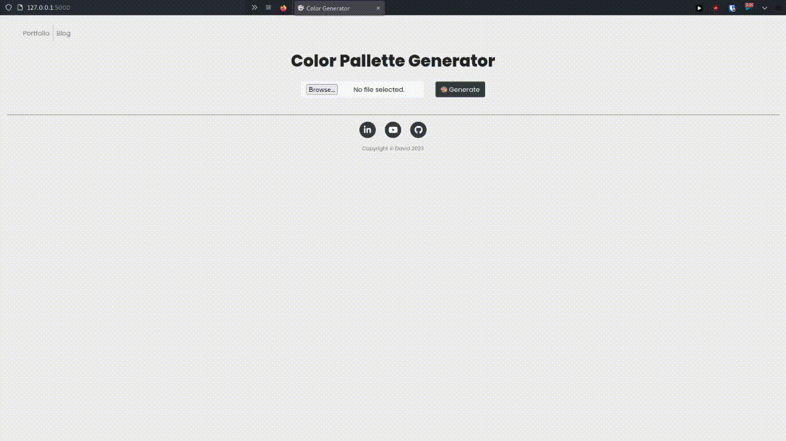
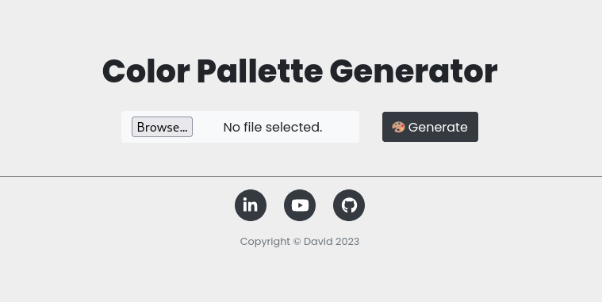

<h1 align='center'>🎨 Color Palette Generator</h1>

<h4 align='center'>Generate a beautiful colorscheme from an image of your choosing.</h4>

<br>



- I made a [youtube video](https://youtu.be/kYvVSWl5gaI) on this project.
- [Live link](https://colorgenerator.onrender.com/) to the project.
	- *Note: It will take some time for the website to load when you click the link*
- Check out my other projects [here](https://davidcao.xyz)!


<!-- ABOUT THE PROJECT -->
## About The Project

I have so many beautiful images with nice color schemes. I wanted to grab inspiration from these images into my own projects, hence, I created this color pallette generator!

### Built With

Python3

<!-- GETTING STARTED -->
## Getting Started

The following instructions will help you get set up locally. Don't hesitate to message me if you have any problems!

### Prerequisites

- [python 3](https://www.python.org/downloads/)
- The [python installer package installer](https://pip.pypa.io/en/stable/installation/): `pip` (used to install required dependencies)
```sh
python -m ensurepip --upgrade
```

### Installation

1. Clone the repo
```sh
git clone git@github.com:dave-cao/ColorGenerator.git
```
3. Install pip packages
```sh
pip install -r requirements.txt
```

<!-- USAGE EXAMPLES -->
## Usage

### Running Locally

1. Run the application
```sh
python3 main.py
```
2. Access the webpage via:
```
http://127.0.0.1:5000
```

3. Exit application
```
ctl + c
```

### On the Website - [Link to Generator](https://colorgenerator.onrender.com/)

1. You will first be greeted with this page.



2. Click on `browse` and select the image you want to extract the colors from.

3. Press `Generate` and voila! Now all you have to do is wait for your pallette to generate.

4. Note that since this is a free hosted site, generating the pallette may take ~10-20 seconds!

_For a more comprehensive example of using this application, refer to this [video](https://youtu.be/kYvVSWl5gaI)_


<!-- ROADMAP -->
## Roadmap

At the moment, I have no future plans for this website. However, I could see perhaps batch generating color pallettes or exporting your color pallette colours into a csv or txt file. 


<!-- CONTRIBUTING -->
## Contributing

Contributions are what make the open source community such an amazing place to learn, inspire, and create. Any contributions you make are **greatly appreciated**.

If you have a suggestion that would make this better, please fork the repo and create a pull request. You can also simply open an issue with the tag "enhancement".
Don't forget to give the project a star! Thanks again!

1. Fork the Project
2. Create your Feature Branch (`git checkout -b feature/AmazingFeature`)
3. Commit your Changes (`git commit -m 'Add some AmazingFeature'`)
4. Push to the Branch (`git push origin feature/AmazingFeature`)
5. Open a Pull Request


<!-- CONTACT -->
## Contact

#### David Cao
- Email: sirdavidcao@gmail.com
- [Youtube](https://www.youtube.com/channel/UCEnBPbnNnqhQIIhW1uLXrLA)
- [Linkedin](https://www.linkedin.com/in/david-cao99/)
- Personal Website: https://davidcao.xyz/
- Project Link - https://github.com/dave-cao/ColorGenerator


